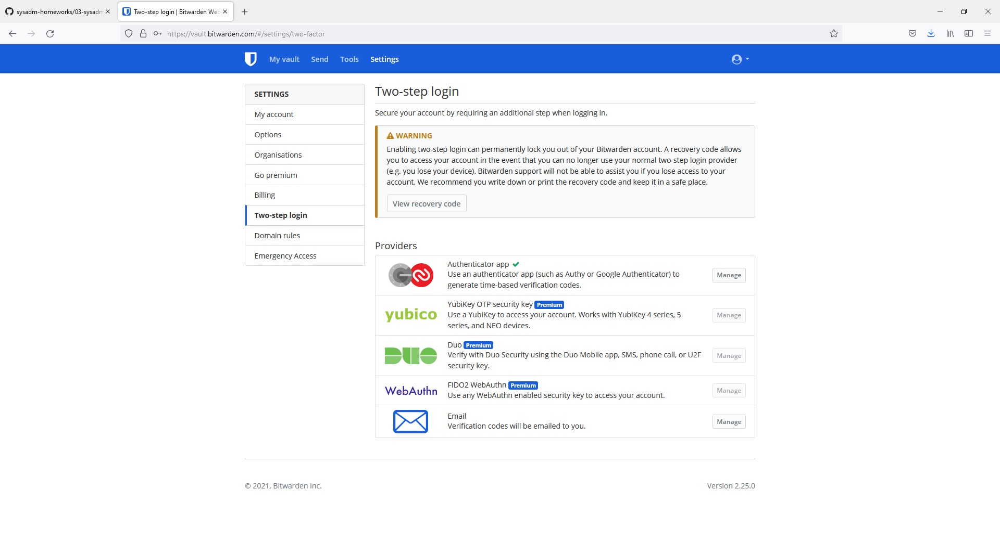

Домашнее задание к занятию "3.9. Элементы безопасности информационных систем"

1 . Установите Bitwarden плагин для браузера. Зарегестрируйтесь и сохраните несколько паролей.

2 . Установите Google authenticator на мобильный телефон. Настройте вход в Bitwarden акаунт через Google authenticator OTP.

3 . Установите apache2, сгенерируйте самоподписанный сертификат, настройте тестовый сайт для работы по HTTPS.

    vagrant@vagrant:~$ sudo systemctl status apache2
    ● apache2.service - The Apache HTTP Server
     Loaded: loaded (/lib/systemd/system/apache2.service; enabled; vendor preset: enabled)
     Active: active (running) since Fri 2021-12-17 19:29:29 UTC; 54s ago
       Docs: https://httpd.apache.org/docs/2.4/
      Main PID: 13548 (apache2)
      Tasks: 55 (limit: 1071)
     Memory: 5.6M
     CGroup: /system.slice/apache2.service
             ├─13548 /usr/sbin/apache2 -k start
             ├─13549 /usr/sbin/apache2 -k start
             └─13550 /usr/sbin/apache2 -k start

    Dec 17 19:29:29 vagrant systemd[1]: Starting The Apache HTTP Server...
    Dec 17 19:29:29 vagrant systemd[1]: Started The Apache HTTP Server.

    vagrant@vagrant:~$ sudo ufw app list
    Available applications:
     Apache
     Apache Full
     Apache Secure
    OpenSSH

    vagrant@vagrant:~$ sudo ufw allow 'Apache Secure'
    Rules updated
    Rules updated (v6)

    vagrant@vagrant:~$ sudo a2enmod ssl
    Considering dependency setenvif for ssl:
    Module setenvif already enabled
    Considering dependency mime for ssl:
    Module mime already enabled
    Considering dependency socache_shmcb for ssl:
    Enabling module socache_shmcb.
    Enabling module ssl.
    See /usr/share/doc/apache2/README.Debian.gz on how to configure SSL and create self-signed certificates.
    To activate the new configuration, you need to run:
      systemctl restart apache2
    vagrant@vagrant:~$ sudo systemctl restart apache2

    vagrant@vagrant:~$ sudo openssl req -x509 -nodes -days 365 -newkey rsa:2048 -keyout /etc/ssl/private/apache-selfsigned.key -out /etc/ssl/certs/apache-selfsigned.crt
    Generating a RSA private key
    ...................................................................................+++++
    ..............................+++++
    writing new private key to '/etc/ssl/private/apache-selfsigned.key'
    -----
    You are about to be asked to enter information that will be incorporated
    into your certificate request.
    What you are about to enter is what is called a Distinguished Name or a DN.
    There are quite a few fields but you can leave some blank
    For some fields there will be a default value,
    If you enter '.', the field will be left blank.
    -----
    Country Name (2 letter code) [AU]:RU
    string is too long, it needs to be no more than 2 bytes long
    Country Name (2 letter code) [AU]:
    State or Province Name (full name) [Some-State]:
    Locality Name (eg, city) []:
    Organization Name (eg, company) [Internet Widgits Pty Ltd]:
    Organizational Unit Name (eg, section) []:
    Common Name (e.g. server FQDN or YOUR name) []:oleg.batalov.com
    Email Address []:

    vagrant@vagrant:/etc/apache2/sites-available$ cat oleg.batalov.com.conf
    <VirtualHost *:443>
    ServerName oleg.batalov.com
    DocumentRoot /var/www/html/index.html

    SSLEngine on
    SSLCertificateFile /etc/ssl/certs/apache-selfsigned.crt
    SSLCertificateKeyFile /etc/ssl/private/apache-selfsigned.key
    </VirtualHost>

    vagrant@vagrant:/etc/apache2/sites-available$ sudo a2ensite oleg.batalov.com.conf
    Site oleg.batalov.com already enabled
    vagrant@vagrant:/etc/apache2/sites-available$ sudo apache2ctl configtest
    Syntax OK

    vagrant@vagrant:/etc/apache2/sites-available$ sudo systemctl reload apache2

Браузер пожаловался на то, что сертификат не trusted, и позволил зайти на сайт.

4 . Проверьте на TLS уязвимости произвольный сайт в интернете (кроме сайтов МВД, ФСБ, МинОбр, НацБанк, РосКосмос, РосАтом, РосНАНО и любых госкомпаний, объектов КИИ, ВПК ... и тому подобное).

    vagrant@vagrant:~/testssl.sh$ ./testssl.sh -U --sneaky https://netology.ru

    ###########################################################
    testssl.sh       3.1dev from https://testssl.sh/dev/
    (2201a28 2021-12-13 18:24:34 -- )

      This program is free software. Distribution and
             modification under GPLv2 permitted.
      USAGE w/o ANY WARRANTY. USE IT AT YOUR OWN RISK!

       Please file bugs @ https://testssl.sh/bugs/

    ###########################################################

    Using "OpenSSL 1.0.2-chacha (1.0.2k-dev)" [~183 ciphers]
    on vagrant:./bin/openssl.Linux.x86_64
    (built: "Jan 18 17:12:17 2019", platform: "linux-x86_64")

    Start 2021-12-18 10:15:50        -->> 100.96.71.114:443 (netology.ru) <<--

    rDNS (100.96.71.114):   netology.ru.
    Service detected:       HTTP

    Testing vulnerabilities

    Heartbleed (CVE-2014-0160)                not vulnerable (OK), no heartbeat extension
    CCS (CVE-2014-0224)                       not vulnerable (OK)
    Ticketbleed (CVE-2016-9244), experiment.  not vulnerable (OK), no session tickets
    ROBOT                                     not vulnerable (OK)
    Secure Renegotiation (RFC 5746)           OpenSSL handshake didn't succeed
    Secure Client-Initiated Renegotiation     not vulnerable (OK)
    CRIME, TLS (CVE-2012-4929)                not vulnerable (OK)
    BREACH (CVE-2013-3587)                    potentially NOT ok, "gzip" HTTP compression detected. - only supplied "/" tested
                                           Can be ignored for static pages or if no secrets in the page
    POODLE, SSL (CVE-2014-3566)               not vulnerable (OK)
    TLS_FALLBACK_SCSV (RFC 7507)              Downgrade attack prevention supported (OK)
    SWEET32 (CVE-2016-2183, CVE-2016-6329)    VULNERABLE, uses 64 bit block ciphers
    FREAK (CVE-2015-0204)                     not vulnerable (OK)
    DROWN (CVE-2016-0800, CVE-2016-0703)      not vulnerable on this host and port (OK)
                                           make sure you don't use this certificate elsewhere with SSLv2 enabled services
                                           https://censys.io/ipv4?q=0E745E5E77A60345EB6E6B33B99A36286C2203D687F3377FBC685B2434518C53 could help you to find out
    LOGJAM (CVE-2015-4000), experimental      not vulnerable (OK): no DH EXPORT ciphers, no DH key detected with <= TLS 1.2
    BEAST (CVE-2011-3389)                     TLS1: ECDHE-RSA-AES128-SHA AES128-SHA ECDHE-RSA-AES256-SHA AES256-SHA DES-CBC3-SHA
                                           VULNERABLE -- but also supports higher protocols  TLSv1.1 TLSv1.2 (likely mitigated)
    LUCKY13 (CVE-2013-0169), experimental     potentially VULNERABLE, uses cipher block chaining (CBC) ciphers with TLS. Check patches
    Winshock (CVE-2014-6321), experimental    not vulnerable (OK)
    RC4 (CVE-2013-2566, CVE-2015-2808)        no RC4 ciphers detected (OK)

    Done 2021-12-18 10:16:24 [  36s] -->> 100.96.71.114:443 (netology.ru) <<--

5 . Установите на Ubuntu ssh сервер, сгенерируйте новый приватный ключ. Скопируйте свой публичный ключ на другой сервер. Подключитесь к серверу по SSH-ключу.

    vagrant@vagrant:~$ sudo apt install openssh-server -y
    Reading package lists... Done
    Building dependency tree
    Reading state information... Done
    openssh-server is already the newest version (1:8.2p1-4ubuntu0.3).
    0 upgraded, 0 newly installed, 0 to remove and 105 not upgraded.
    vagrant@vagrant:~$ sudo systemctl enable ssh
    Synchronizing state of ssh.service with SysV service script with /lib/systemd/systemd-sysv-install.
    Executing: /lib/systemd/systemd-sysv-install enable ssh
    vagrant@vagrant:~$ sudo systemctl start ssh

    vagrant@vagrant:~$ sudo systemctl status ssh
    ● ssh.service - OpenBSD Secure Shell server
     Loaded: loaded (/lib/systemd/system/ssh.service; enabled; vendor preset: enabled)
     Active: active (running) since Sat 2021-12-18 10:55:40 UTC; 5min ago
       Docs: man:sshd(8)
             man:sshd_config(5)
      Main PID: 14695 (sshd)
      Tasks: 1 (limit: 1071)
     Memory: 1.1M
     CGroup: /system.slice/ssh.service
             └─14695 sshd: /usr/sbin/sshd -D [listener] 0 of 10-100 startups

    Dec 18 10:55:40 vagrant systemd[1]: Starting OpenBSD Secure Shell server...
    Dec 18 10:55:40 vagrant sshd[14695]: Server listening on 0.0.0.0 port 22.
    Dec 18 10:55:40 vagrant sshd[14695]: Server listening on :: port 22.
    Dec 18 10:55:40 vagrant systemd[1]: Started OpenBSD Secure Shell server.

    vagrant@vagrant:~$ sudo ufw allow ssh
    Rules updated
    Rules updated (v6)

    vagrant@vagrant:~$ ssh-keygen -t rsa -b 4096
    Generating public/private rsa key pair.
    Enter file in which to save the key (/home/vagrant/.ssh/id_rsa):
    Enter passphrase (empty for no passphrase):
    Enter same passphrase again:
    Your identification has been saved in /home/vagrant/.ssh/id_rsa
    Your public key has been saved in /home/vagrant/.ssh/id_rsa.pub

    vagrant@master:~/.ssh$ ssh-copy-id vagrant@10.0.0.11
    /usr/bin/ssh-copy-id: INFO: Source of key(s) to be installed: "/home/vagrant/.ssh/id_rsa.pub"
    The authenticity of host '10.0.0.11 (10.0.0.11)' can't be established.
    ECDSA key fingerprint is SHA256:wSHl+h4vAtTT7mbkj2lbGyxWXWTUf6VUliwpncjwLPM.
    Are you sure you want to continue connecting (yes/no/[fingerprint])? yes
    /usr/bin/ssh-copy-id: INFO: attempting to log in with the new key(s), to filter out any that are already installed
    /usr/bin/ssh-copy-id: INFO: 1 key(s) remain to be installed -- if you are prompted now it is to install the new keys
    vagrant@10.0.0.11's password:

    Number of key(s) added: 1

    Now try logging into the machine, with:   "ssh 'vagrant@10.0.0.11'"
    and check to make sure that only the key(s) you wanted were added.

    vagrant@master:~/.ssh$ ssh 'vagrant@10.0.0.11'
    Welcome to Ubuntu 20.04.2 LTS (GNU/Linux 5.4.0-80-generic x86_64)

    * Documentation:  https://help.ubuntu.com
    * Management:     https://landscape.canonical.com
    * Support:        https://ubuntu.com/advantage

      System information as of Sat 18 Dec 2021 12:13:16 PM UTC

      System load:  0.07              Processes:             110
     Usage of /:   2.5% of 61.31GB   Users logged in:       1
      Memory usage: 15%               IPv4 address for eth0: 10.0.2.15
      Swap usage:   0%                IPv4 address for eth1: 10.0.0.11

    This system is built by the Bento project by Chef Software
    More information can be found at https://github.com/chef/bento
    Last login: Sat Dec 18 12:07:43 2021 from 10.0.2.2

6. Переименуйте файлы ключей из задания 5. Настройте файл конфигурации SSH клиента, так чтобы вход на удаленный сервер осуществлялся по имени сервера.

        vagrant@master:~/.ssh$ mv id_rsa id_rsa.bkup
        vagrant@master:~/.ssh$ mv id_rsa.pub id_rsa.pub.bkup
        vagrant@master:~/.ssh$ touch config
        vagrant@master:~/.ssh$ chmod 600 config
   
        vagrant@master:~/.ssh$ cat config
        Host slave
        IdentityFile ~/.ssh/id_rsa
            HostName slave
           User vagrant
            Port 22

        vagrant@master:~/.ssh$ ssh vagrant@slave
          Welcome to Ubuntu 20.04.2 LTS (GNU/Linux 5.4.0-80-generic x86_64)

        * Documentation:  https://help.ubuntu.com
         * Management:     https://landscape.canonical.com
         * Support:        https://ubuntu.com/advantage

         System information as of Sat 18 Dec 2021 12:59:48 PM UTC

         System load:  0.08              Processes:             111
         Usage of /:   2.5% of 61.31GB   Users logged in:       0
         Memory usage: 15%               IPv4 address for eth0: 10.0.2.15
         Swap usage:   0%                IPv4 address for eth1: 10.0.0.11

      This system is built by the Bento project by Chef Software
      More information can be found at https://github.com/chef/bento
      Last login: Sat Dec 18 12:58:45 2021 from 10.0.0.10
      vagrant@slave:~$

7 . Соберите дамп трафика утилитой tcpdump в формате pcap, 100 пакетов. Откройте файл pcap в Wireshark.

      vagrant@master:~/.ssh$ sudo tcpdump -c 100 -w /tmp/packet.pcap
      tcpdump: listening on eth0, link-type EN10MB (Ethernet), capture size 262144 bytes
      100 packets captured
      110 packets received by filter
      0 packets dropped by kernel

      vagrant@master:~/.ssh$ wireshark -r /tmp/packet.pcap
      qt.qpa.xcb: could not connect to display
      qt.qpa.plugin: Could not load the Qt platform plugin "xcb" in "" even though it was found.
      This application failed to start because no Qt platform plugin could be initialized. Reinstalling the application may fix this problem.

      Available platform plugins are: eglfs, linuxfb, minimal, minimalegl, offscreen, vnc, xcb.

      Aborted (core dumped)

Не удалось запустить wireshark на Linux машине. Пробовал всякие решения, не помогло.
Поэтому пришлось установить инструмент на Windows хост машине.

   
   
    

