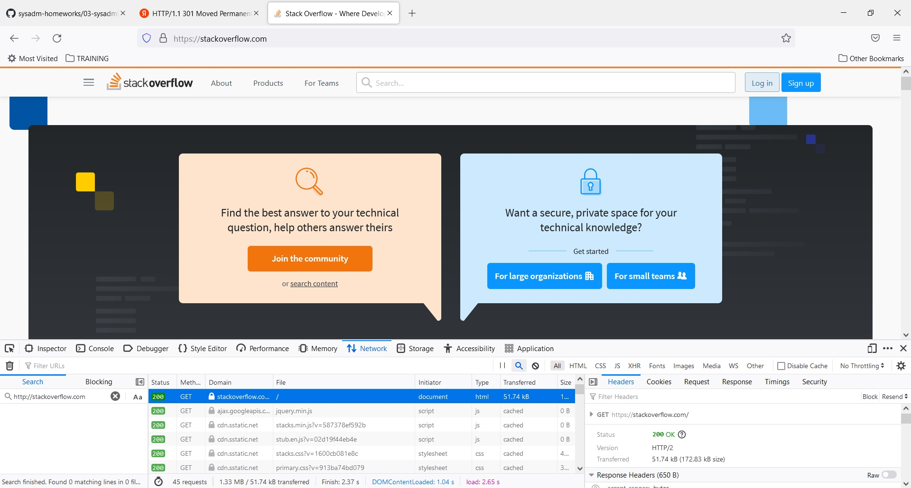
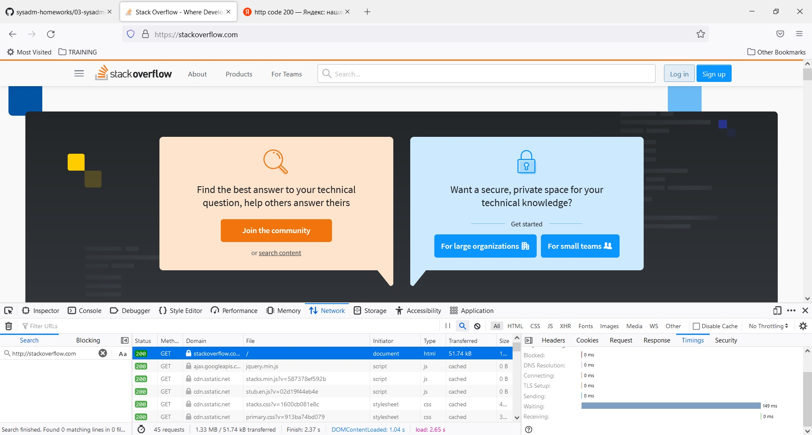
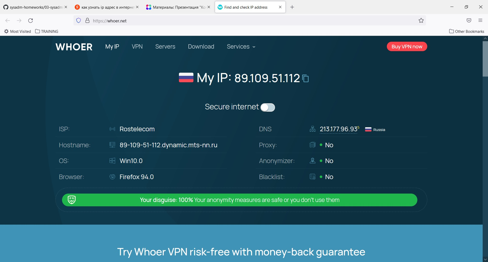

Домашнее задание к занятию "3.6. Компьютерные сети, лекция 1"

1 . Работа c HTTP через телнет.

Подключитесь утилитой телнет к сайту stackoverflow.com telnet stackoverflow.com 80
отправьте HTTP запрос

    GET /questions HTTP/1.0
    HOST: stackoverflow.com
    [press enter]
    [press enter]

    В ответе укажите полученный HTTP код, что он означает?

    HTTP/1.1 301 Moved Permanently

Код состояния HTTP 301 — стандартный код ответа HTTP, получаемый в ответ от сервера в ситуации, когда запрошенный ресурс был на постоянной основе перемещён в новое месторасположение, и указывающий на то, что текущие ссылки, использующие данный URL, должны быть обновлены. 

2 . Повторите задание 1 в браузере, используя консоль разработчика F12.

    откройте вкладку Network
    отправьте запрос http://stackoverflow.com
    найдите первый ответ HTTP сервера, откройте вкладку Headers
    укажите в ответе полученный HTTP код.
    проверьте время загрузки страницы, какой запрос обрабатывался дольше всего?
    приложите скриншот консоли браузера в ответ.

Код 200 OK

Данный GET запрос в списке, судя по timings консоли, выполнялся дольше всего.

3 . Какой IP адрес у вас в интернете?

   

4 . Какому провайдеру принадлежит ваш IP адрес? Какой автономной системе AS? Воспользуйтесь утилитой whois

    vagrant@vagrant:~$ whois 89.109.51.112
    % This is the RIPE Database query service.
    % The objects are in RPSL format.
    %
    % The RIPE Database is subject to Terms and Conditions.
    % See http://www.ripe.net/db/support/db-terms-conditions.pdf

    % Note: this output has been filtered.
    %       To receive output for a database update, use the "-B" flag.

    % Information related to '89.109.44.0 - 89.109.51.255'

    % Abuse contact for '89.109.44.0 - 89.109.51.255' is 'abuse@rt.ru'

    inetnum:        89.109.44.0 - 89.109.51.255
    netname:        PPPoE-PG-NAT-POOL4
    descr:          Network for PPPoE clients terminations in
    descr:          N.Novgorod city
    country:        RU
    admin-c:        VT-RU
    tech-c:         VT-RU
    status:         ASSIGNED PA
    mnt-by:         MNT-VOLGATELECOM
    created:        2021-05-13T10:00:08Z
    last-modified:  2021-05-13T10:00:08Z
    source:         RIPE

    role:           OJSC Rostelecom, Nizhny Novgorod

IP адрес принадлежит Ростелеком.

% Information related to '89.109.48.0/22AS12389'

route:          89.109.48.0/22
descr:          Rostelecom networks
origin:         AS12389
mnt-by:         MNT-VOLGATELECOM
created:        2021-05-13T10:07:44Z
last-modified:  2021-05-13T10:07:44Z
source:         RIPE

AS номер AS12389.

5 . Через какие сети проходит пакет, отправленный с вашего компьютера на адрес 8.8.8.8? Через какие AS? Воспользуйтесь утилитой traceroute

