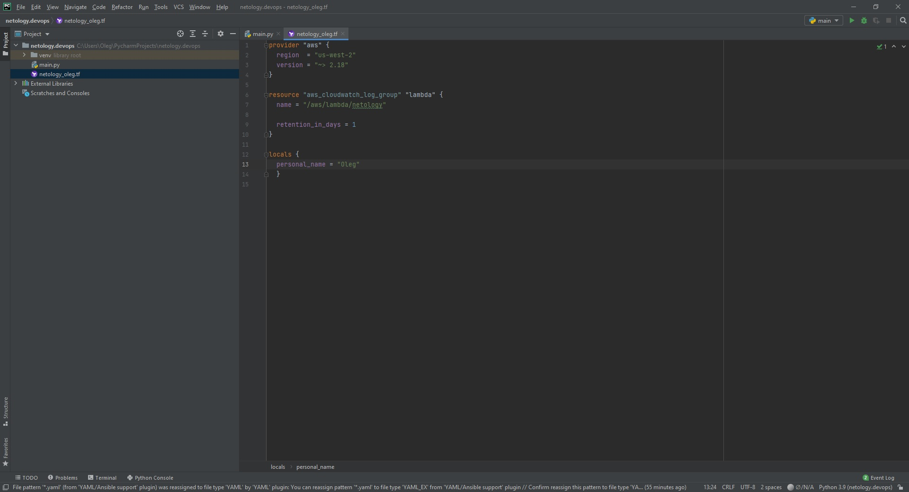

# netology-devops

## Задание №1 - Подготовка рабочей среды

### Ссылки
    - Terraform: 
    - Bash: 
    - Markdown: 
    - Yaml: 
    - Jsonnet: 

## Задание №2

Описание истории

Представьте, что вы работаете в стартапе, который запустил интернет-магазин. 
Ваш интернет-магазин достаточно успешно развивался, 
и вот пришло время налаживать процессы: у вас стало больше конечных клиентов, 
менеджеров и разработчиков.Сейчас от клиентов вам приходят задачи, связанные с 
разработкой нового функционала. Задач много, и все они требуют выкладки на тестовые среды, 
одобрения тестировщика, проверки менеджером перед показом клиенту. В случае необходимости, 
вам будет необходим откат изменений.

Решение задачи

Вам необходимо описать процесс решения задачи в соответствии с жизненным циклом 
разработки программного обеспечения. Использование какого-либо конкретного метода 
разработки не обязательно. Для решения главное - прописать по пунктам шаги решения 
задачи (релизации в конечный результат) с участием менеджера, разработчика 
(или команды разработчиков), тестировщика (или команды тестировщиков) и 
себя как DevOps-инженера.

###Процесс решения задачи в соответствии с жизненным циклом разработки программного обеспечения и место в нем девопс инженера

Не совсем уверен, что понял задание. Поэтому пишу, как я его понял.

Фактически, в моем понимании, девопс это больше методология, чем просто отдельная профессия. 
Дев Опс участвует на всех этапах разработки. 

Пример: задача расширения возможностей оплаты, нужна поддержка попялярных методов, Google Pay, например.

1. Фаза планирования решения задачи

а. Роль:Клиент, менеджер 
   Действия: 
   - описываются проблема и требование по новому функционалу: поддержка нового метода оплаты и 
     возможность работы магазина с более значительным потоком клиентов.
   - формируется запрос на решение проблемы.
     
б. Роль DevOps 
   Действия: 
   - настройка инструментов для выявления ценности нового требования к функционалу - путем сбора информации и отзывов клиентов 
   - автоматизация отслеживания проблем в целом (интерфейс с клиентом), управления проектом.
   
в. Роль:  Проектировщики, программисты,DevOps инженер
   Действия: 
   - уточнение и формирование требований к приложению и архитектуре
   - формирование технического задания по решению проблемы, описание архитектуры решения

   
2. Кодирование и билд
   
а. Роли: программисты
   Действия: 
   - разработка программного обеспечения для внедрения функционала
   - ревью кода
   - разработка тестов
   - билд версии

б. Роль: DevOps
   Действие:
   - непрерывная интеграция нового кода с имеющимся кодом
   - наладка механизмов контроля версий

3. Тестирование
   
а. Роль: тестировщики
   Действие: 
   - выкатка программы в тестовое окружение
   
б. Роль: тестировщики
   Действие: 
   - тестирование решения
   - проверка результатов тестирования

в. Роль: DevOps инженер
   Действие:
   - автоматизация процесса тестирования и создание инструментов для создания виртуальных тестовых сред

   
4. Релиз и деплой

а. Роль: специалист поддержки
   Действие: 
   - вывод решения в пре-прод окружение (staging) и прод
   - откат на предыдущую версию 
   - тестирование с клиентами
     
б. Роль: DevOps инженер
   Действие:
   - автоматизация задач, связанных с настройкой и выводом приложений, а также откатом изменения
   
5. Мониторинг и эксплуатация

а. Роль: специалист поддержки
   Действие:
   - поддержка приложения и решения
   - мониторинг багов и проблем

б. Роль: DevOps инженер
   Действия:
   - автоматизация мониторинга и задач эксплуатации приложения 

---> новый цикл разработки с учетом новых требований.

