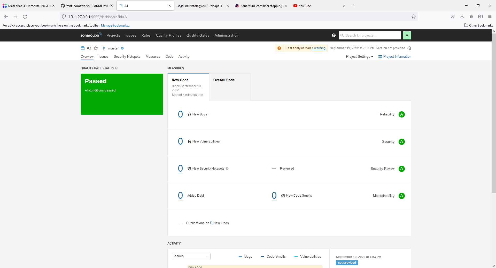
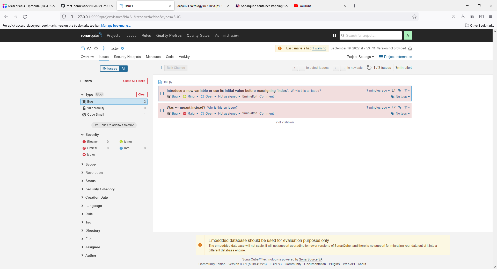
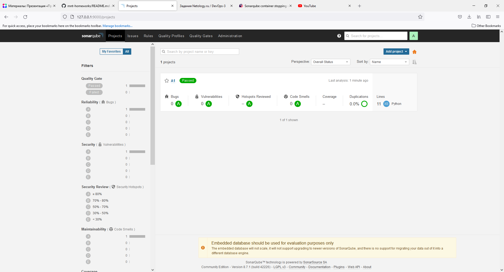
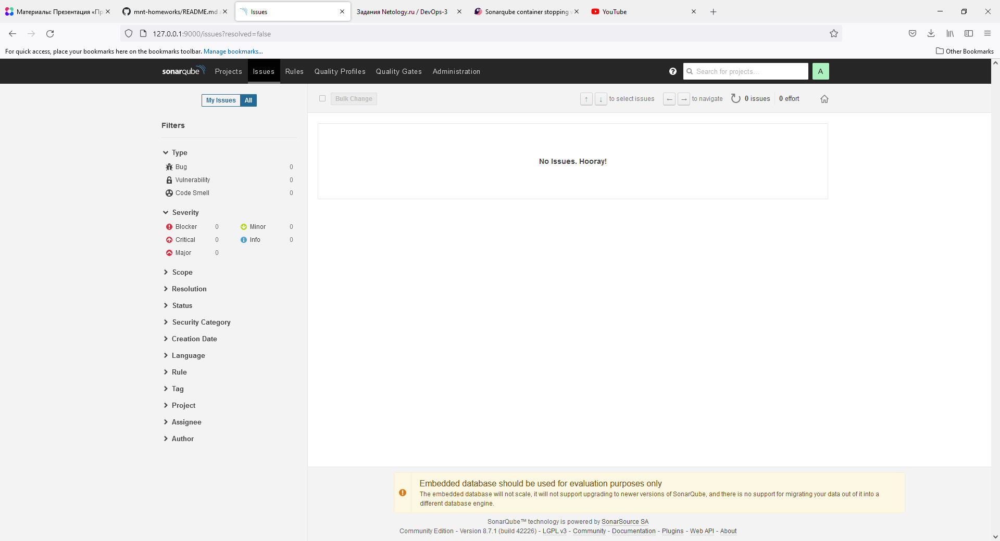

# Домашнее задание к занятию "09.02 CI\CD"

## Знакомоство с SonarQube

### Подготовка к выполнению

1. Выполняем `docker pull sonarqube:8.7-community`
2. Выполняем `docker run -d --name sonarqube -e SONAR_ES_BOOTSTRAP_CHECKS_DISABLE=true -p 9000:9000 sonarqube:8.7-community`
3. Ждём запуск, смотрим логи через `docker logs -f sonarqube`
4. Проверяем готовность сервиса через [браузер](http://localhost:9000)
5. Заходим под admin\admin, меняем пароль на свой

В целом, в [этой статье](https://docs.sonarqube.org/latest/setup/install-server/) описаны все варианты установки, включая и docker, но так как нам он нужен разово, то достаточно того набора действий, который я указал выше.

### Основная часть

1. Создаём новый проект, название произвольное
2. Скачиваем пакет sonar-scanner, который нам предлагает скачать сам sonarqube
3. Делаем так, чтобы binary был доступен через вызов в shell (или меняем переменную PATH или любой другой удобный вам способ)
4. Проверяем `sonar-scanner --version`
   
```
vagrant@server1:/downloads/sonarqube$ sonar-scanner --version
INFO: Scanner configuration file: /opt/sonar-scanner/conf/sonar-scanner.properties
INFO: Project root configuration file: NONE
INFO: SonarQube Scanner 4.2.0.1873
INFO: Java 11.0.3 AdoptOpenJDK (64-bit)
INFO: Linux 5.4.0-80-generic amd64
```

5. Запускаем анализатор против кода из директории [example](./example) с дополнительным ключом `-Dsonar.coverage.exclusions=fail.py`
   



6. Смотрим результат в интерфейсе
7. Исправляем ошибки, которые он выявил(включая warnings)
   

8. Запускаем анализатор повторно - проверяем, что QG пройдены успешно
9. Делаем скриншот успешного прохождения анализа, прикладываем к решению ДЗ




## Знакомство с Nexus

### Подготовка к выполнению

1. Выполняем `docker pull sonatype/nexus3`
2. Выполняем `docker run -d -p 8081:8081 --name nexus sonatype/nexus3`
3. Ждём запуск, смотрим логи через `docker logs -f nexus`
4. Проверяем готовность сервиса через [бразуер](http://localhost:8081)
5. Узнаём пароль от admin через `docker exec -it nexus /bin/bash`
6. Подключаемся под админом, меняем пароль, сохраняем анонимный доступ

```buildoutcfg
2022-09-19 21:30:32,527+0000 WARN  [FelixStartLevel] *SYSTEM com.orientechnologies.common.util.OMemory - The sum of the configured JVM maximum heap size (2740846592 bytes) and the OrientDB maximum cache size (268435456 bytes) is larger than the available physical memory size (com.orientechnologies.common.jna.ONative$MemoryLimitResult@26ffacf bytes). That may cause out of memory errors, please tune the configuration up. Use the -Xmx JVM option to lower the JVM maximum heap memory size or storage.diskCache.bufferSize OrientDB option to lower memory requirements of the cache.
2022-09-19 21:30:32,730+0000 INFO  [FelixStartLevel] *SYSTEM com.orientechnologies.orient.server.OSystemDatabase - $ANSI{green {db=OSystem}} Creating the system database 'OSystem' for current server
```
Похоже, проблема с доступной памятью. У вас есть идея, как поменять настройки?

Пока я пробовал

sudo docker run -it --rm -p 8081:8081 --name nexus -e INSTALL4J_ADD_VM_PARAMS="-Xms750m -Xmx750m -XX:MaxDirectMemorySize=750m  -Djava.util.prefs.userRoot=/some-other-dir" sonatype/nexus3

Не получается, та же ошибка

### Основная часть

1. В репозиторий `maven-public` загружаем артефакт с GAV параметрами:
   1. groupId: netology
   2. artifactId: java
   3. version: 8_282
   4. classifier: distrib
   5. type: tar.gz
2. В него же загружаем такой же артефакт, но с version: 8_102
3. Проверяем, что все файлы загрузились успешно
4. В ответе присылаем файл `maven-metadata.xml` для этого артефекта

### Знакомство с Maven

### Подготовка к выполнению

1. Скачиваем дистрибутив с [maven](https://maven.apache.org/download.cgi)
2. Разархивируем, делаем так, чтобы binary был доступен через вызов в shell (или меняем переменную PATH или любой другой удобный вам способ)
3. Проверяем `mvn --version`
4. Забираем директорию [mvn](./mvn) с pom

### Основная часть

1. Меняем в `pom.xml` блок с зависимостями под наш артефакт из первого пункта задания для Nexus (java с версией 8_282)
2. Запускаем команду `mvn package` в директории с `pom.xml`, ожидаем успешного окончания
3. Проверяем директорию `~/.m2/repository/`, находим наш артефакт
4. В ответе присылаем исправленный файл `pom.xml`

---

### Как оформить ДЗ?

Выполненное домашнее задание пришлите ссылкой на .md-файл в вашем репозитории.

---
