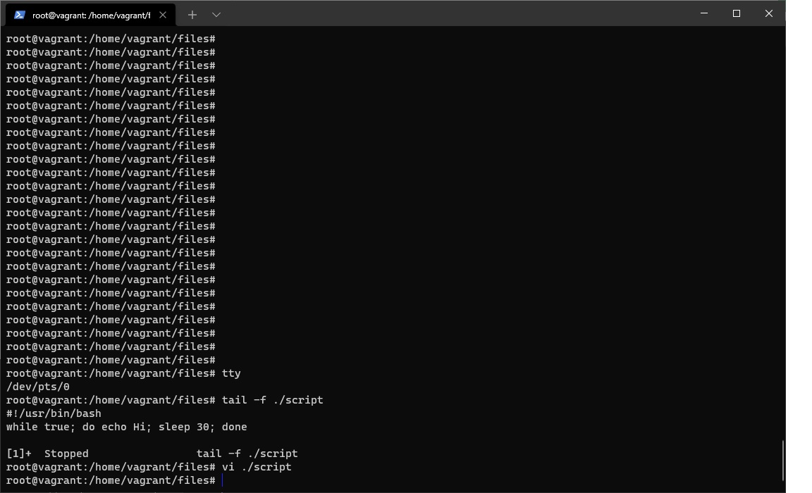
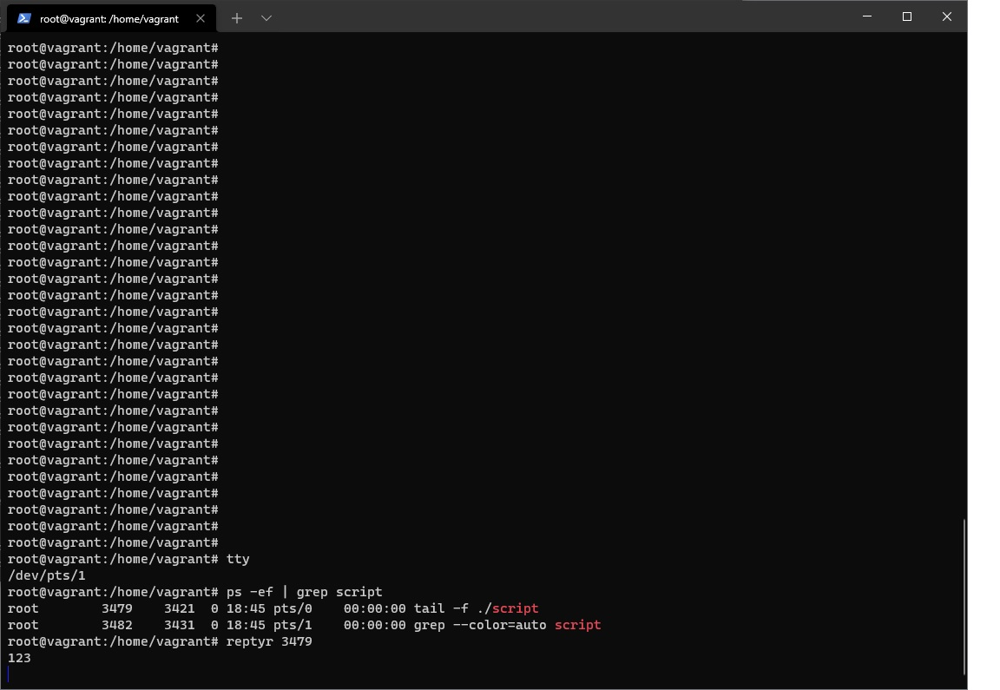

Домашнее задание к занятию "3.2. Работа в терминале, лекция 2"

1 . Какого типа команда cd? Попробуйте объяснить, почему она именно такого типа; опишите ход своих мыслей, если считаете что она могла бы быть другого типа.

cd это внутренняя, встроенная по отношению к командной оболочке команда (built-in). Она меняет текущую папку только для оболочки, в которой выполняется. 
В man данная команда описана как утилита. 

Комментарий к вопросу: вопрос не очень понятен. Пожайлуста, поясняйте его суть, потому что без контекста сам вопрос не очень понятен. Пришлось догадываться, о чем вопрос.

Вопрос, который я получил от проверяющего, мне вообще не понятен. 

Задание 1
Нужно было выполнить type cd. Это задание на умение определять типы и на понимание работы с каталогами.

Мой второй комментарий, к заметке на доработку:
А что не так с ответом выше? 
Вот команда, если мой ответ на русском непонятен.

vagrant@vagrant:~$ type cd
cd is a shell builtin

2 . Какая альтернатива без pipe команде grep <some_string> <some_file> | wc -l? man grep поможет в ответе на этот вопрос. Ознакомьтесь с документом о других подобных некорректных вариантах использования pipe.

grep -c <some_string> <some_file>

3 . Какой процесс с PID 1 является родителем для всех процессов в вашей виртуальной машине Ubuntu 20.04?

/sbin/init

Комментарий проверяющего:
Задание 3
Уточните ответ для указанной ОС?

Мой ответ:
У меня стоит как раз та же ОС, что и указано в вопросе. Вопрос проверяющего некорректен. Что вы здесь проверяете - знание основных процессов и файлов, или установку конкретной ОС?

Вот поподробнее:
vagrant@vagrant:~$ uname -a
Linux vagrant 5.4.0-80-generic #90-Ubuntu SMP Fri Jul 9 22:49:44 UTC 2021 x86_64 x86_64 x86_64 GNU/Linux
vagrant@vagrant:~$ ps -eaf | grep init
root           1       0  0 18:42 ?        00:00:01 /sbin/init
vagrant     1161    1149  0 18:52 pts/0    00:00:00 grep --color=auto init

4 . Как будет выглядеть команда, которая перенаправит вывод stderr ls на другую сессию терминала?

Как пример, ls 2>/dev/pts/1

5 . Получится ли одновременно передать команде файл на stdin и вывести ее stdout в другой файл? Приведите работающий пример.

grep '1 2 3' < file > file1

6 . Получится ли находясь в графическом режиме, вывести данные из PTY в какой-либо из эмуляторов TTY? Сможете ли вы наблюдать выводимые данные?

Получится. Пример: date 1>/dev/tty1
Смог наблюдать выводимые данные.

7 . Выполните команду bash 5>&1. К чему она приведет? Что будет, если вы выполните echo netology > /proc/$$/fd/5? Почему так происходит?

Выполнение команды bash 5>&1 не приводит к результату на экране. Выполнение самой команды bash 5 приводит к ошибке, 
но мы ее (STDERR) не выводим в STDOUT.

8 . Получится ли в качестве входного потока для pipe использовать только stderr команды, не потеряв при этом отображение stdout на pty? Напоминаем: по умолчанию через pipe передается только stdout команды слева от | на stdin команды справа. Это можно сделать, поменяв стандартные потоки местами через промежуточный новый дескриптор, который вы научились создавать в предыдущем вопросе.

ls 2>&1 | cat -

Вопрос проверяющего:
Задание 8
Здесь происходит дублирование потоков, а нужно их разделить.
Рекомендую посмотреть: catonmat.net...part-three

Мой ответ: спасибо за ссылку. По настоящему нужный материал. Включите его как источник для обучающихся.

Переработанный ответ:
ls files files1 3>&1 1>&2 2>&3 | less

9 . Что выведет команда cat /proc/$$/environ? Как еще можно получить аналогичный по содержанию вывод?

Команда выводит изначальное окружение при выполнении прораммы/процесса. Такой вывод выдают команды env,printenv.

10 . Используя man, опишите что доступно по адресам /proc/<PID>/cmdline, /proc/<PID>/exe

/proc/[pid]/cmdline содержит полную строку команды, если только это не зомби процесс. Данный файл содержит аргументы команды как набор строк, разделенных так называемыми нулевыми байтами.
('\0').

/proc/[pid]/exe - данный файл это указатель на имя директории исполняемой команды. Его stat выглядит как symlink.

11 . Узнайте, какую наиболее старшую версию набора инструкций SSE поддерживает ваш процессор с помощью /proc/cpuinfo.

sse, sse2, sse4a

12 . При открытии нового окна терминала и vagrant ssh создается новая сессия и выделяется pty. Это можно подтвердить командой tty, которая упоминалась в лекции 3.2. Однако:

vagrant@netology1:~$ ssh localhost 'tty'

not a tty

Почитайте, почему так происходит, и как изменить поведение.

Насколько я понимаю, при выполнении ssh нет локального tty. 
Чтобы изменить поведение, нужно добавить флаг -t. Документации на сей счет немного, если у вас есть поподробнее, буду благодарен за ссылку. На сайте Vagrant я не нашел описания такой ситуации.

      ssh -t localhost 'tty'

13 . Бывает, что есть необходимость переместить запущенный процесс из одной сессии в другую. Попробуйте сделать это, воспользовавшись reptyr. Например, так можно перенести в screen процесс, который вы запустили по ошибке в обычной SSH-сессии.

Скриншоты с reptyr показаны. Комментарий - крайне неудачно выбрана утилита. Она работает только под пользователем root и имеет баги. 

Комментарий проверяющего:
Задание 13
Как без рута или sudo переносить процесс из одной сессии в другую?

Ответ:
В первой терминальной сессии сделать
- screen -D -R
- запустить команду, например, top
- отделить ее от сессии командами CTRL-Z, CTRL-A, CTRL-D

Появляется сообщение на экране типа
vagrant@vagrant:~$ screen -D -R
[detached from 1431.pts-0.vagrant]

Во второй терминальной сессии:
- screen -D -R
- jobs
- fg %1

У меня данный способ сработал без sudo и корневого пользователя.

14 . sudo echo string > /root/new_file не даст выполнить перенаправление под обычным пользователем, так как перенаправлением занимается процесс shell'а, который запущен без sudo под вашим пользователем. Для решения данной проблемы можно использовать конструкцию echo string | sudo tee /root/new_file. Узнайте что делает команда tee и почему в отличие от sudo echo команда с sudo tee будет работать.

Команда tee читает стандартный ввод и пишет в стандартный вывод и файлы. Команда sudo echo string > /root/new_file не сработает, потому что перенаправление в файл в ней выполняется командной оболочкой обычного, непривилегированного пользователя. В случае с echo string | sudo tee /root/new_file это делает сама команда, запущенная с sudo.

