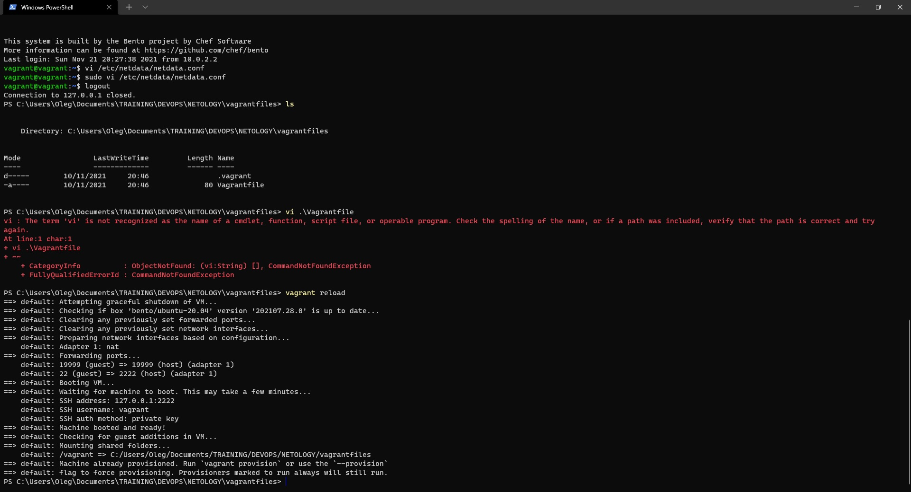

1 . 

На лекции мы познакомились с node_exporter. В демонстрации его исполняемый файл запускался в background. Этого достаточно для демо, но не для настоящей production-системы, где процессы должны находиться под внешним управлением. Используя знания из лекции по systemd, создайте самостоятельно простой unit-файл для node_exporter:
- поместите его в автозагрузку,    
- предусмотрите возможность добавления опций к запускаемому процессу через внешний файл (посмотрите, например, на systemctl cat cron),
- удостоверьтесь, что с помощью systemctl процесс корректно стартует, завершается, а после перезагрузки автоматически поднимается.

Содержание Unit-файла

    vagrant@vagrant:~/node_exporter$ systemctl cat node_exporter
    # Warning: node_exporter.service changed on disk, the version systemd has loaded is outdated.
    # This output shows the current version of the unit's original fragment and drop-in files.
    # If fragments or drop-ins were added or removed, they are not properly reflected in this output.
    # Run 'systemctl daemon-reload' to reload units.
    # /lib/systemd/system/node_exporter.service
    [Unit]
    Description=node_exporter service

    [Service]
    User=vagrant
    Type=idle
    EnvironmentFile=-/home/vagrant/node_exporter/node_exporter.env
    ExecStart=/home/vagrant/node_exporter/node_exporter-1.3.0.linux-amd64/node_exporter --collector.${collector}
    Restart=on-failure

    [Install]
    WantedBy=multi-user.target
    
    sudo chmod 644 /lib/systemd/system/node_exporter.service

Добавление в автозагрузку Linux

    sudo systemctl daemon-reload
    sudo systemctl enable node_exporter.service
    vagrant@vagrant:~/node_exporter$ systemctl list-unit-files | grep enabled | grep node_exporter
    node_exporter.service                  enabled         enabled
    
    vagrant@vagrant:~/node_exporter$ sudo systemctl start node_exporter
    vagrant@vagrant:~/node_exporter$ pgrep node_exporter
    1571
    vagrant@vagrant:~/node_exporter$ sudo systemctl stop node_exporter
    vagrant@vagrant:~/node_exporter$ pgrep node_exporter
    vagrant@vagrant:~/node_exporter$
    
После перезагрузки машины:

    vagrant@vagrant:~$ uptime
    20:29:46 up 2 min,  1 user,  load average: 0.03, 0.03, 0.00
    vagrant@vagrant:~$ ps -eaf | grep node_exporter
    vagrant      609       1  0 20:27 ?        00:00:00 /home/vagrant/node_exporter/node_exporter-1.3.0.linux-amd64/node_exporter
    vagrant      889     786  0 20:29 pts/0    00:00:00 grep --color=auto node_exporter
    
2 . Ознакомьтесь с опциями node_exporter и выводом /metrics по-умолчанию. Приведите несколько опций, которые вы бы выбрали для базового мониторинга хоста по CPU, памяти, диску и сети.

    curl http://localhost:9100/metrics
    
    node_cpu_seconds_total{cpu="0",mode="idle"} 1438.62
    node_cpu_seconds_total{cpu="0",mode="iowait"} 0.61
    node_cpu_seconds_total{cpu="0",mode="irq"} 0
    node_cpu_seconds_total{cpu="0",mode="nice"} 0
    node_cpu_seconds_total{cpu="0",mode="softirq"} 0.03
    node_cpu_seconds_total{cpu="0",mode="steal"} 0
    node_cpu_seconds_total{cpu="0",mode="system"} 3.61
    node_cpu_seconds_total{cpu="0",mode="user"} 1.73
    
    node_memory_Percpu_bytes 1.06496e+06
    
    node_memory_Shmem_bytes 667648
    node_memory_SwapFree_bytes 1.027600384e+09
    
    node_disk_read_time_seconds_total{device="dm-0"} 11.504
    node_disk_write_time_seconds_total{device="dm-0"} 0.804
    
    node_netstat_Tcp_ActiveOpens 4
    node_netstat_Tcp_InErrs 0
    node_netstat_Udp_InDatagrams 0
    
3 . Установите в свою виртуальную машину Netdata. Воспользуйтесь готовыми пакетами для установки (sudo apt install -y netdata). После успешной установки:
в конфигурационном файле /etc/netdata/netdata.conf в секции [web] замените значение с localhost на bind to = 0.0.0.0,
    добавьте в Vagrantfile проброс порта Netdata на свой локальный компьютер и сделайте vagrant reload:

    config.vm.network "forwarded_port", guest: 19999, host: 19999

После успешной перезагрузки в браузере на своем ПК (не в виртуальной машине) вы должны суметь зайти на localhost:19999. Ознакомьтесь с метриками, которые по умолчанию собираются Netdata и с комментариями, которые даны к этим метрикам.

4 . Можно ли по выводу dmesg понять, осознает ли ОС, что загружена не на настоящем оборудовании, а на системе виртуализации?

Можно.

    [    0.000000] Hypervisor detected: KVM
    [    0.000000] DMI: innotek GmbH VirtualBox/VirtualBox, BIOS VirtualBox 12/01/2006
    [    0.003716] CPU MTRRs all blank - virtualized system.
    [    0.080117] Booting paravirtualized kernel on KVM
    [    0.220552] Performance Events: PMU not available due to virtualization, using software events only.
    [    2.432049] systemd[1]: Detected virtualization oracle.

5 . Как настроен sysctl fs.nr_open на системе по-умолчанию? Узнайте, что означает этот параметр. Какой другой существующий лимит не позволит достичь такого числа (ulimit --help)?

    vagrant@vagrant:~$ sysctl fs.nr_open
    fs.nr_open = 1048576
    
Параметр означает максимальное количество открытых файлов.

    vagrant@vagrant:~$ ulimit -n
    1024
    
Лимит на количство открытых файловых дескрипторов.

6 . Запустите любой долгоживущий процесс (не ls, который отработает мгновенно, а, например, sleep 1h) в отдельном неймспейсе процессов; покажите, что ваш процесс работает под PID 1 через nsenter. Для простоты работайте в данном задании под root (sudo -i). Под обычным пользователем требуются дополнительные опции (--map-root-user) и т.д.
    
    vagrant@vagrant:~$ sudo -i
    root@vagrant:~# nsenter --target 1672 --pid --mount
    root@vagrant:/# ps aux
    USER         PID %CPU %MEM    VSZ   RSS TTY      STAT START   TIME COMMAND
    root           1  0.0  0.0   8076   580 pts/1    S+   21:10   0:00 sleep 1h
    root           2  0.0  0.4   9836  4040 pts/2    S    21:12   0:00 -bash
    root          11  0.0  0.3  11492  3396 pts/2    R+   21:12   0:00 ps aux
    
7 . Найдите информацию о том, что такое :(){ :|:& };:. Запустите эту команду в своей виртуальной машине Vagrant с Ubuntu 20.04 (это важно, поведение в других ОС не проверялось). Некоторое время все будет "плохо", после чего (минуты) – ОС должна стабилизироваться. Вызов dmesg расскажет, какой механизм помог автоматической стабилизации. Как настроен этот механизм по-умолчанию, и как изменить число процессов, которое можно создать в сессии?

Функция с именем :, которая порождает саму себя, цепная реакция fork'ов

    :()
    {
        :|:&
    };
    :

    [ 4821.205874] cgroup: fork rejected by pids controller in /user.slice/user-1000.slice/session-4.scope

Механизм process number controller помог стабилизировать машину. 
    root@vagrant:~# ulimit -u
    3571
    
    root@vagrant:~# systemctl status user-1000.slice
    ● user-1000.slice - User Slice of UID 1000
         Loaded: loaded
       Drop-In: /usr/lib/systemd/system/user-.slice.d
                └─10-defaults.conf
         Active: active since Mon 2021-11-22 19:17:58 UTC; 2h 26min ago
          Docs: man:user@.service(5)
          Tasks: 14 (limit: 2356)
      
    root@vagrant:/etc/systemd/system# cat /sys/fs/cgroup/pids/user.slice/user-1000.slice/pids.max
    2356
    
Нужно поменять значение в этом файле.

